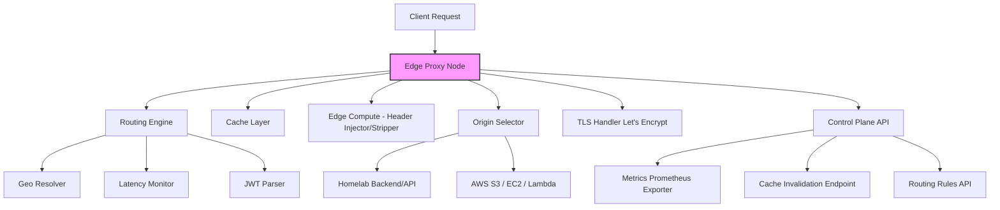

# EdgeStorm

**EdgeStorm** is a high-performance, programmable edge proxy and hybrid CDN written in Go. It intelligently routes requests between homelab and cloud infrastructure (AWS), supports in-memory caching, dynamic header manipulation, and TLS termination with Let's Encrypt.

---

## 🌐 Key Features

- 🌍 Geo-based intelligent routing using MaxMind GeoIP
- ⚡ Latency-aware fallback routing for dynamic optimization
- 🔐 Role-based routing with JWT support
- 🧠 Edge compute for header injection/removal
- 🗂 In-memory caching with TTL
- 🔒 HTTPS termination at the edge
- 📡 Prometheus metrics and API-based control plane

---

## 🧱 Architecture Overview



---

## 📁 Project Structure

```
edgestorm/
├── .github/workflows/ci.yml       # GitHub Actions CI
├── cmd/edgestorm/                 # Main entry point
├── internal/                      # Application logic
│   ├── proxy/                     # Reverse proxy logic
│   ├── cache/                     # In-memory TTL caching
│   ├── routing/                   # GeoIP, latency, and JWT logic
│   ├── headers/                   # Header injection/removal
│   ├── tls/                       # TLS termination
│   ├── control/                   # Control plane APIs
│   └── metrics/                   # Prometheus metrics
├── configs/                       # Configuration files
├── assets/maxmind/               # GeoIP databases
├── go.mod / go.sum
├── README.md
```

---

## 🧪 Development

Run tests locally:

```bash
go test ./... -v
```

Lint your code:

```bash
go vet ./...
go fmt ./...
```

---

## 🚀 CI/CD

EdgeStorm uses [GitHub Actions](https://github.com/features/actions) for automated testing, linting, and formatting.

---

## 🔒 TLS

This proxy uses [Let’s Encrypt](https://letsencrypt.org/) via Go’s `autocert` package for automated HTTPS certificate management.

---

## 📊 Monitoring

- Prometheus metrics endpoint: `/metrics`
- Control Plane APIs for:
  - Cache management
  - Routing updates
  - Stats and introspection

---

## 🛠 Tech Stack

- Language: Go
- CDN: Custom edge proxy logic
- Caching: In-memory with TTL
- Security: HTTPS, JWT
- Metrics: Prometheus
- Infra: Homelab + AWS

---

## 📌 License

MIT — open for experimentation, modification, and improvement.
